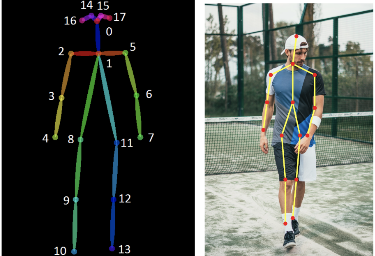
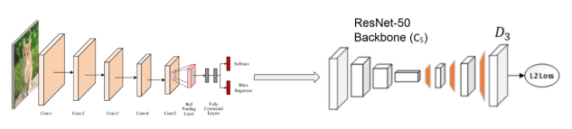
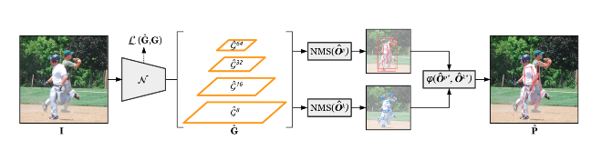

# Human_Pose_Estimation
Performance Evaluation of state-of-the-art Deep Learning based Human Pose Estimation Methods.

Human pose estimation is a process of identifying and classifying the joints in the human body as a set of coordinates called as keypoints.
- The connection between the key points is called as pair.
- In order to form a pair the connections between the keypoints has to be significant.
- These pairs can be used to describe the pose of a person.


## *Comparative analysis of Simple Baseline model and KAPAO*

### *Simple Baseline Model*
Simple Baseline Model is a two stage approach


### *KAPAO Model (Yolo-v5 based)*
KAPAO is a single stage multi-person human pose estimation approach.


### Citation
Our work is based on the research of:
```
@inproceedings{xiao2018simple,
    author={Xiao, Bin and Wu, Haiping and Wei, Yichen},
    title={Simple Baselines for Human Pose Estimation and Tracking},
    booktitle = {European Conference on Computer Vision (ECCV)},
    year = {2018}
}
```
```
@article{mcnally2021kapao,
  title={Rethinking Keypoint Representations: Modeling Keypoints and Poses as Objects for Multi-Person Human Pose Estimation},
  author={McNally, William and Vats, Kanav and Wong, Alexander and McPhee, John},
  journal={arXiv preprint arXiv:2111.08557},
  year={2021}
}
```